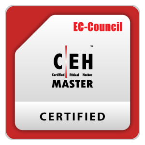
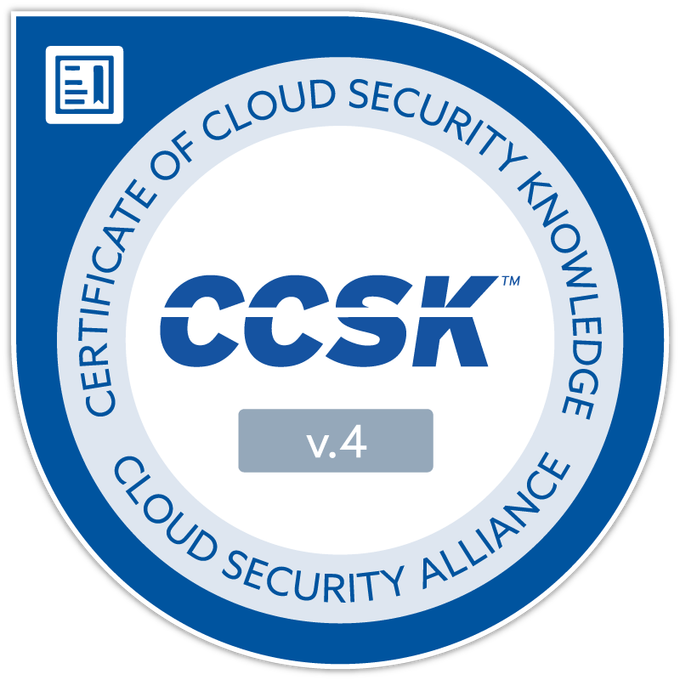
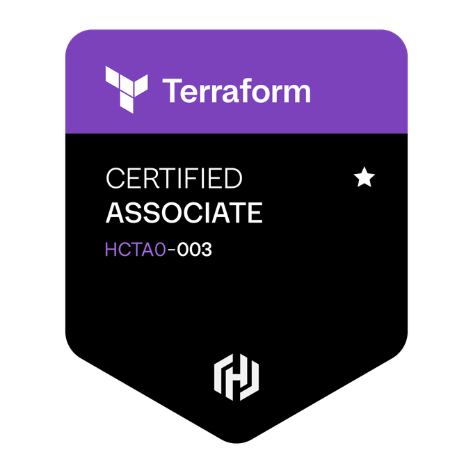

# Deep Dive Security
<!--
**deepdivesecurity/deepdivesecurity** is a ✨ _special_ ✨ repository because its `README.md` (this file) appears on your GitHub profile.
!-->

<h2>
  👤 About Me
  &nbsp;
  
</h2>

  <table width="100%" border="0" cellpadding="10" cellspacing="0">
    <tr>
      <td width="60%" valign="top">
        
<em>Cloud Architect - Security</em>

        <ul>
          <li>🌱 &nbsp;I’m currently studying for the <strong>CISSP</strong></li>
          <li>📖 &nbsp;Learn more about my projects on my <strong><a href="https://deepdivesecurity.ca">blog</a></strong></li>
          <li>📬 &nbsp;Ask me anything on my <strong><a href="https://github.com/deepdivesecurity/deepdivesecurity/issues/1">issues page</a></strong></li>
        </ul>
      </td>
      <td width="40%" valign="top" align="center">
        <strong>Certifications</strong>  
        
        
        
         
        
        
      </td>
    </tr>
  </table>

## 🐙 GitHub Stats
<!-- LOC Stats SVG -->

  <!-- LOC-STATS:START -->
  <!-- -->
  <!-- LOC-STATS:END -->

<!-- Github Stats -->

  
  

## 🛠️ Tech Stack & Skills

  <table width="100%", border="0">
    <tr>
      <td align="center" width="50%">
        <strong>Languages</strong> 
        
      </td>
      <td align="center" width="50%">
        <strong>CSPs</strong> 
        
      </td>
    </tr>
    <tr>
      <td align="center" width="50%">
        <strong>OS</strong> 
        
      </td>
      <td align="center" width="50%">
        <strong>Other</strong> 
        
      </td>
    </tr>
  </table>

